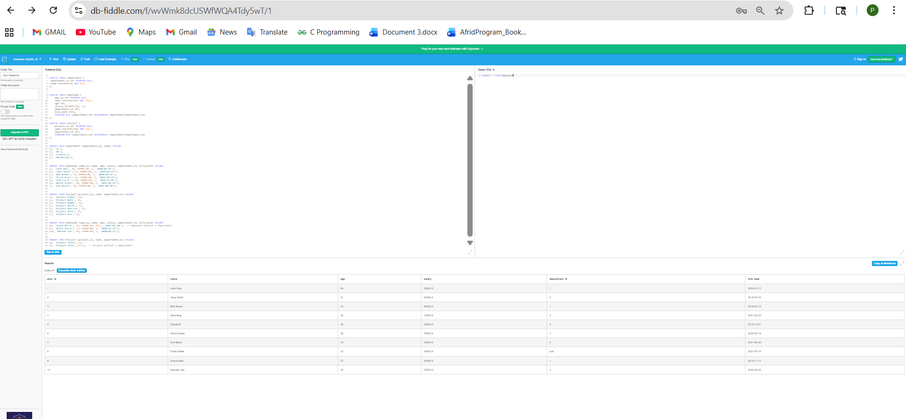
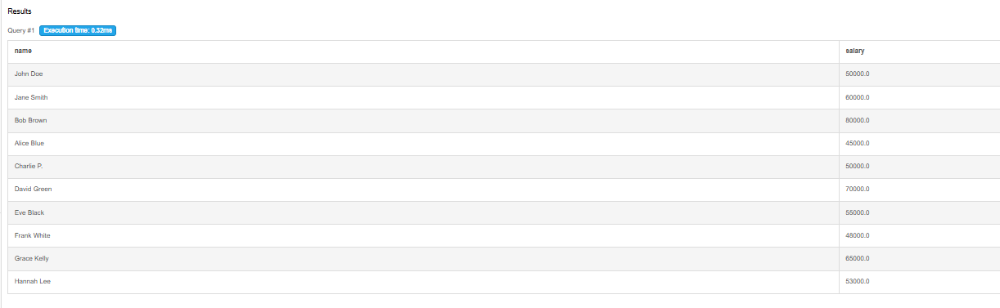
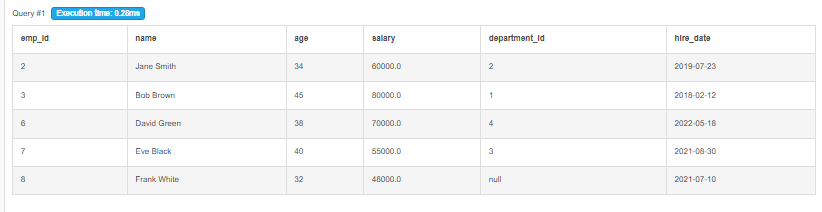
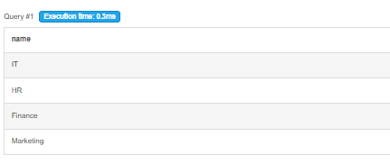
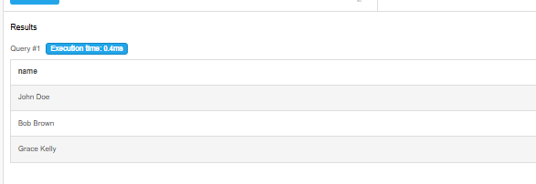

# Day 1 Output Screenshots

This folder contains query execution screenshots for Week 1 - Day 1 SQL practice.

## Topics Covered

- Basic SQL Queries
- String Matching Queries
- Date Queries
- Aggregate Functions
- GROUP BY & HAVING Queries

---

## 📸 Here are some output screenshots from the SQL queries practiced using DB Fiddle.

---

# Query Outputs

## Query 1 - Select All Records

---

## Query 2 - Employee Names and Salaries

---

## Query 3 - Employees Older Than 30

---

## Query 4 - Department Names

---

## Query 5 - Employees Working in IT Department

---

# Practice Platform

- DB Fiddle
- SQL Environment

---

Week 1 - Day 1 Outputs Completed 
