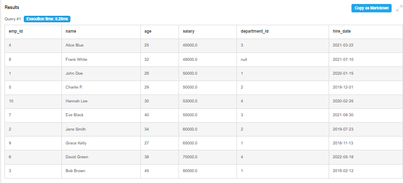
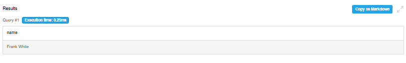
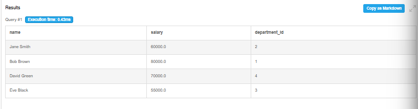

# Day 2 Output Screenshots

This folder contains query execution screenshots for Week 1 - Day 2 SQL practice.

## Topics Covered

- ORDER BY Queries
- JOIN Operations
- Nested Queries
- Correlated Queries
- Moderate Difficulty SQL Queries

---

## 📸 Here are some output screenshots from the advanced SQL queries practiced using DB Fiddle.

---

# Query Outputs

## Query 31 - Employees Ordered by Salary

---

## Query 41 - Employees Not Assigned to Any Project

---

## Query 64 - Employee with Highest Salary in Each Department

---

# Practice Platform

- DB Fiddle
- SQL Environment

---

Week 1 - Day 2 Outputs Completed 🚀
